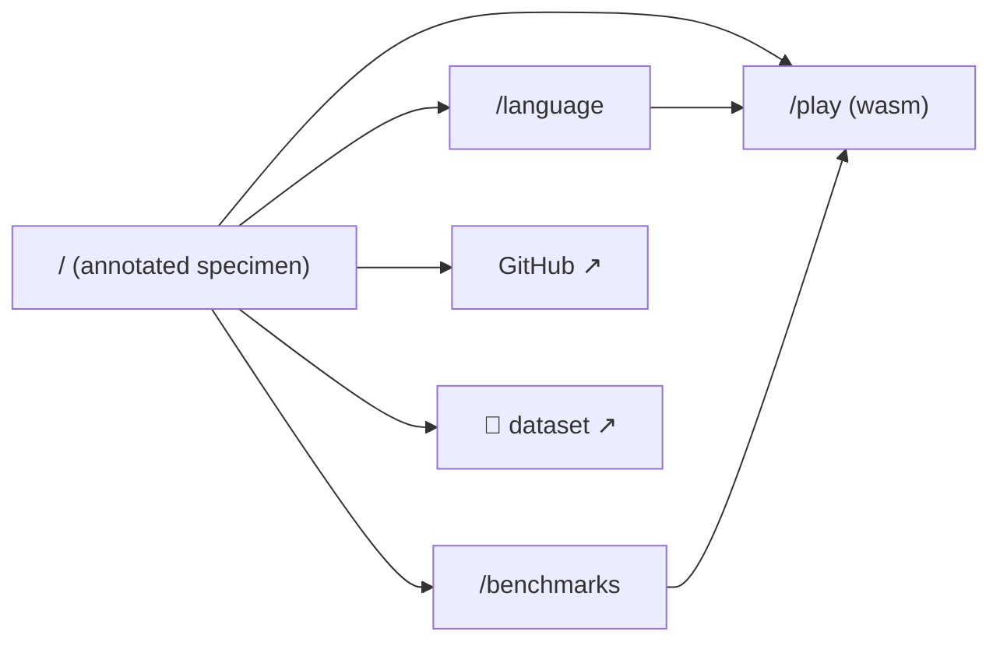

# curtlang.com — UX blueprint

- **Version:** v1
- **Date:** 2026-06-12
- **Status:** accepted v1 (paradigm + treatment chosen in interview; refine with `/gui-blueprint revise`)
- **Scope:** the public brand/info site at curtlang.com (multi-page hub, GitHub Pages, embeds the live wasm playground at `/play/`).

> **SKETCH, NOT DESIGN.** This document fixes *structure* — what is on screen,
> what composes with what, the navigation shape. It deliberately says nothing
> about color, type, or tokens; those belong to the visual-design phase.

> **Banned incumbent (greenfield → genre default banned):** the dev-tool
> landing of *centered hero headline + gradient + three feature cards + logo
> wall + CTA*. That composition is forbidden as a concept. (Also banned: the
> dashboard-with-sidebar.)

## Interview record

**Round 0 — scope (asked during site kickoff):**
- Site shape → **multi-page hub**
- Playground → **embed on-site** (`/play/`)
- Hosting → **GitHub Pages** (workflow + CNAME)
- Visual direction → **fresh brand** (distinct from the playground tool UI)

**Round 1 — soul (inferred from the repo + round 0, stated for the record):**
- Primary verb → **evaluate / compare / try** (a skeptic deciding "is this real?"), not "make"
- User → **mixed, technical-skewed** (AI engineers, agent builders, language-curious devs); density-tolerant but needs a hook for skimmers
- Feel → **precise instrument / editorial-technical**; the doctrine *measured, never estimated* IS the brand soul
- Backing capability for any interactivity → the **real js-tiktoken o200k + wasm runner** already shipped in `playground/`

**Round 2 — paradigm (interview, with ASCII previews):**
- Home paradigm → **Spatial (annotated specimen)**
- Hero treatment → **Rotating specimens** (flip through a few real corpus programs)
- Secondary placement → **Home is a launchpad** (keep home tight; depth lives in `/language` and `/benchmarks`)

## The thesis

The hero object is *a curt program and its measured token cost*. The home page
makes that object the screen: one real program, full-bleed, with annotations
anchored to its constructs — each annotation carrying a token cost and a
one-line meaning (`untagged union · full inference · 0 annotations`,
`capability-gated net (deny-first)`, `go · 1 token`). You don't read a pitch
*about* curt; you read curt, and the page teaches you what you're looking at.
Rotating through a small set of corpus specimens (the 32-token TCP echo server
as the face, plus a pipeline and a dense-vs-loops pair) shows range without
turning home into the playground. Home stays a launchpad — annotated hero, the
single strongest proof strip, and three CTAs (Try ▸ · Language · Benchmarks) —
and the depth lives in two pages that reuse the runner-up paradigms:
`/benchmarks` is the **proof-ledger** (claim → measured → reproduce), and
`/language` is the **annotated tour** (the spatial idea applied to the whole
syntax). Grounding: token counts and comparisons are the repo's committed
measurements (README, DESIGN.md, VS-ZERO.md, `tools/tokens`), shown with their
reproduce paths; the live *method* is provable one click away in `/play/`.

## The screens

### Home — `/` (spatial annotated specimen, rotating, launchpad)

```
┌────────────────────────────────────────────────────────────────┐
│ ▍curt                       Language   Benchmarks   Play ▸   ☾  │
├────────────────────────────────────────────────────────────────┤
│  the tokenizer is the ISA                                        │
│  a machine-first language for AI agents — compiled semantics at  │
│  dynamic-language token cost.            [ Try in browser ▸ ]    │
│                                                                  │
│  ┌ specimen ▸ tcp uppercase echo ───────────────┐  ╭ annotations│
│  │ handle c = for ln in c.lines {                │  │ ① equation,│
│  │   c.write (ln.upper + "\n") }        ①②③      │  │   no cere- │
│  │ for c in net.listen 8080 { go handle c }      │  │   mony     │
│  └───────────────────────────────────────────────┘  │ ② cap-gate│
│   ◂ prev          ● ○ ○  (3 specimens)        next ▸  │   net      │
│                                                      │ ③ go·1 tok │
│   ┌ cost ─────────────────────────────────────────┐ ╰───────────│
│   │  curt 32   ·   python 55   ·   go 94   ·  rust 123  reproduce↗│
│   └─────────────────────────────────────────────────┘            │
│                                                                  │
│  proof strip (one line each, every number linked to its source): │
│   1.10× vs Python (n=22) · 0/200 grammar violations ·            │
│   7.7× cheaper than Zerolang (sonnet) · runs in your browser     │
│                                                                  │
│  [ Read the language ▸ ]   [ See the benchmarks ▸ ]              │
└────────────────────────────────────────────────────────────────┘
```
Hovering/focusing a marked span ①②③ in the code highlights its annotation
(and vice versa). On narrow screens the annotations stack beneath the code.

### Language — `/language.html` (annotated tour)

```
┌────────────────────────────────────────────────────────────────┐
│ the shape of curt                                                │
│  ┌ core shape ────────────────┐  ╭ what you're seeing            │
│  │ greet name = "hi {name}"   │  │ equation: name params = expr  │
│  │ total = [1,2,3].sum        │  │ UFCS: x.f a ≡ f x a           │
│  │ xs | keep .active | top 2  │  │ pipeline feeds the LAST arg   │
│  └────────────────────────────┘  ╰────────────────────────────  │
│  sections: core · pipes & UFCS · types & untagged unions ·       │
│            errors (T|err, rescue, propagate) · dense beats loops │
│  each block: real code + annotations; dense pairs show the token │
│  delta (22 tok loop  →  4 tok verb).                             │
│  [ Full spec ↗ ]  [ Cheat sheet ↗ ]  [ llms.txt ↗ ]  [ GitHub ↗ ]│
└────────────────────────────────────────────────────────────────┘
```

### Benchmarks — `/benchmarks.html` (proof-ledger)

```
┌────────────────────────────────────────────────────────────────┐
│ measured, never estimated                                        │
│  CLAIM                         MEASURED          REPRODUCE        │
│  ├ token cost vs Python        1.10× median n=22 tools/tokens ↗   │
│  ├ vs Go / Rust                2.34× / 2.63×     tools/tokens ↗   │
│  ├ grammar-masked generation   0 / 200 violations grammar/DEMO ↗  │
│  ├ vs Zerolang — sonnet        curt 3/3, 7.7× $   headtohead ↗    │
│  ├ vs Zerolang — haiku         split (78% vs 89%) headtohead ↗    │
│  └ Python wins small tasks     honest ✓ (54/54)   VS-ZERO ↗       │
│                                                                  │
│  detail tables (real numbers): the head-to-head matrix · the     │
│  diagnostics tournament (A→D, 18→32/32) · the 32-token server.   │
└────────────────────────────────────────────────────────────────┘
```

### Playground — `/play/` (embedded, unchanged tool surface)

The committed playground bundle, copied verbatim under `/play/`. It is the
*tool* surface (its own self-contained styling); nav links to it. This is
where the live o200k meter and in-browser wasm execution live — the home/
language token numbers are static measured facts, and `/play/` is the proof
that the method is real.

### Navigation shape — hub (flat)



## Object → component contract

| Domain object | Canonical component | Where it appears |
|---|---|---|
| curt **program** (specimen) | `specimen` (annotated code block) | home (rotating, hero), language (per-section) |
| **token cost** | `cost-badge` / `meter` | every specimen; the live meter only in `/play/` |
| **comparison** (vs py/go/rust/zero) | `compare-rail` | home cost strip, benchmarks tables |
| **claim** | `claim-row` (claim · measured · reproduce↗) | benchmarks ledger, home proof strip |
| **language construct** | `annotation` (anchored callout: cost + meaning) | home hero, language tour |
| **benchmark / frozen lane** | `result-table` | benchmarks (h2h matrix, diagnostics tournament) |
| **diagnostic / repair** | (live) playground; (described) language | `/play/`, language errors section |
| **toolchain** | `pipeline-strip` (parse·check·fmt·run·tokens·dense) | language header |

## Invariants made structural

1. **No claim without a receipt.** The `claim-row` component has a required
   `reproduce` slot; a claim literally cannot render without its reproduce
   path. On home, every headline number is a link to its source. This encodes
   *measured, never estimated* into the composition, not the copy.
2. **Honest negatives are first-class.** "Python wins small tasks" and the
   haiku split are `claim-row`s in the same ledger as the wins — not footnotes.
   The structure forbids cherry-picking by giving losses equal slots.
3. **Static facts vs live method are separated.** Home/language token numbers
   are committed measurements (cheap, fast page); the *live* meter and wasm
   execution live only in `/play/`, so the marketing pages never ship the
   2.3 MB tokenizer bundle and the "it's real" proof is one click away.
4. **The specimen is always real corpus.** Rotating specimens are drawn from
   `corpus/` programs with verified counts — never invented snippets.

## What this costs (honest)

- **Responsive spatial annotations.** Anchored callouts that reflow to a
  stacked list on mobile are the main build/polish cost; done with marked
  spans + a paired annotation list (hover/focus links the two), not absolute
  pixel connectors.
- **Token-count drift.** Home/language counts are hardcoded measured facts;
  if the corpus changes they can go stale. Mitigation: cite the reproduce
  command beside each; a later build-time assertion against `curt tokens`
  could harden this (filed as possible follow-up, not built now).
- **Two depth pages to keep honest.** `/benchmarks` must track VS-ZERO.md /
  DESIGN.md as those evolve. The reproduce links point at the canonical files
  so the site degrades to "go read the source" rather than lying.
- **`/play/` weight.** The embedded playground is ~2.3 MB (o200k ranks); it
  loads only on its own page, so home stays light.
- **Fresh brand polish.** A distinct visual identity (next phase) is real
  design time; this blueprint only fixes the structure it must dress.

## Rejected directions

- **Instrument (live meter on home)** — strong and capability-backed, but it
  duplicates `/play/`'s job and would pull the tokenizer bundle onto the
  landing page; the spatial specimen teaches the language better for a first
  visit. *(Demoted: the live meter stays the soul of `/play/`.)*
- **Process (proof-ledger on home)** — excellent for skeptics but reads as an
  argument before the visitor knows what curt looks like. *(Reused: it is the
  structure of `/benchmarks`.)*
- **Centered-hero + feature-cards** — the banned genre default; never on the
  table.
- **Editable hero / one-iconic-program (hero treatments)** — editable risked
  stealing `/play/`; one-program lost the range that rotating specimens show.
